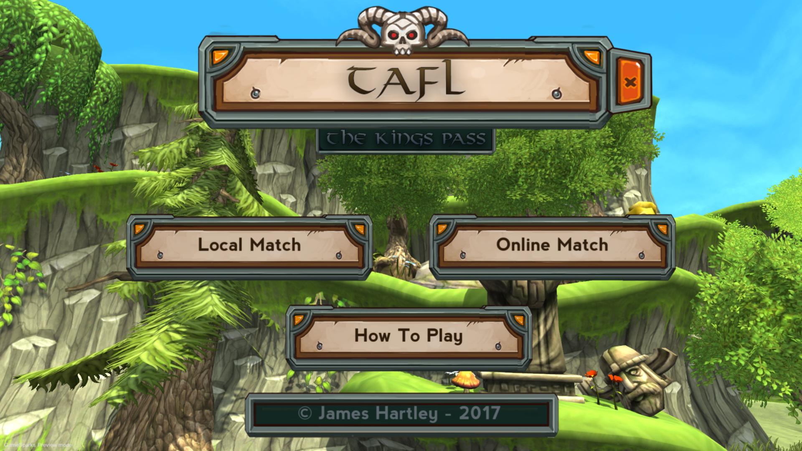
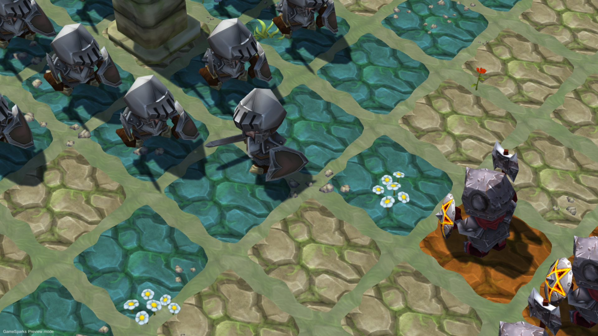
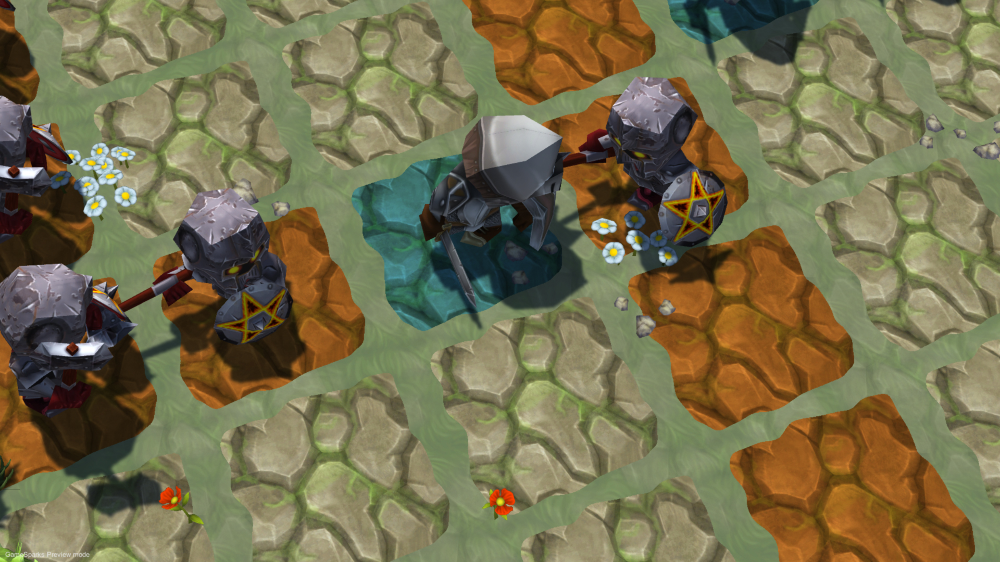
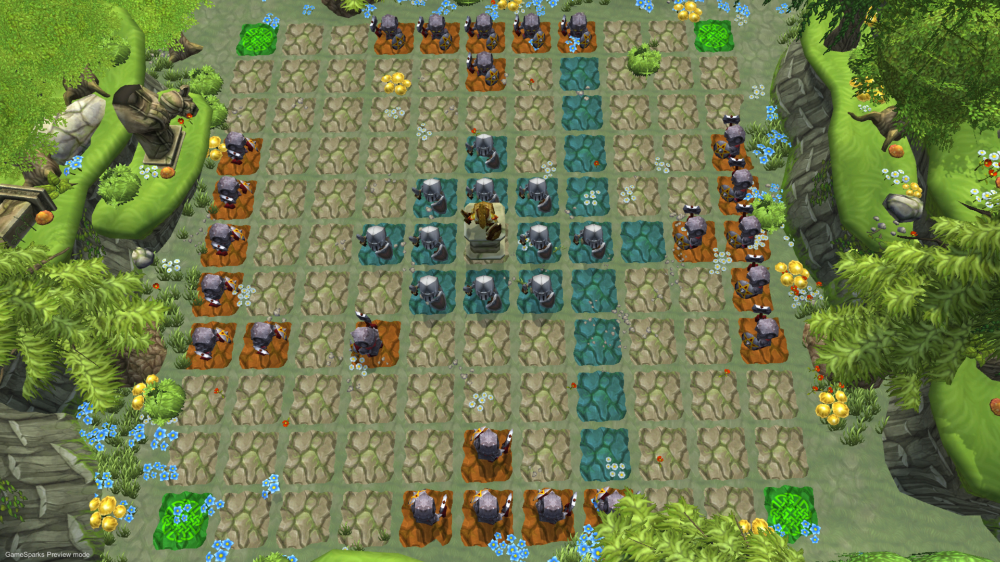

# Tafl: A King Pass



**Note:** Unfortunately, the source code for this game is lost, and it was never officially released. However, you can still download and play this compiled executable.

"Tafl: A King Pass" was originally planned as an iOS and Android game but was never officially released. This game is based on an ancient Viking board game called Hnefatafl, known for its strategic gameplay.

## Gameplay

In "Tafl: A King Pass," you can play a local multiplayer match. Please note that the servers for the multiplayer mode are no longer running. The game was discontinued after it reached an almost completed state. During playtesting with friends, it was determined that the gameplay was not engaging enough. As a result, the project was abandoned, and the lessons learned from this experience have informed future projects.

## Rules of Hnefatafl

In the standard version of Hnefatafl, there are only two types of pieces:

1. The King
2. The Pawns (Vikings)

### How the pieces are allowed to move

- The king and the pawns move in exactly the same way.
- They move similarly to the rook in chess, which means they can move in a straight line from one side of the board to the other, including any squares in between.
- Pieces cannot jump over other pieces.
- Only the king is allowed to occupy the central king's square and corner squares. Other pieces can pass through the central square.
- Neither pawns nor kings can move diagonally. The entire game is about moving in straight lines.

In summary:
- All pieces move in the same way.
- Pieces move in straight lines.
- Pieces can move anywhere from one square to the entire span of the board.
- Pieces cannot jump over other pieces.
- No piece can move diagonally.
- Only the king can occupy the central king's square, but others may pass through it.

## Download and Play

You can download the compiled executable of "Tafl: A King Pass" for windows:

```scope
git clone https://github.com/jdbhartley/Tafl.git
```

Simply open the build folder and run Tafl.exe

## Screenshots





## Credits
- Developed and coded by James Hartley
- All art assets were free downloads from the unity asset store and belong to their respective authors
